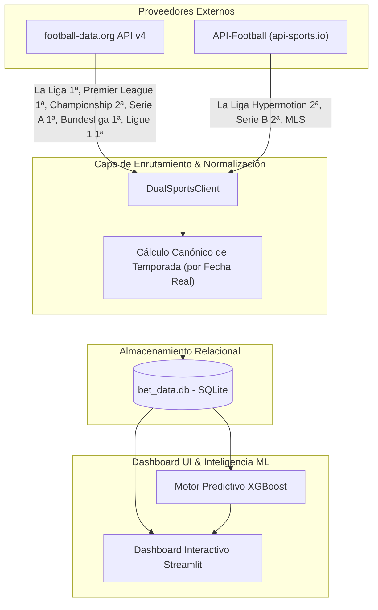

# ⚡ SportsBetIA — Sports Analytics & Machine Learning Platform


**SportsBetIA** es una plataforma agnóstica de analítica deportiva e inteligencia predictiva impulsada por aprendizaje automático (*Machine Learning*). Su objetivo principal es resolver la dispersión y falta de fiabilidad en la recopilación de datos de fútbol, unificando múltiples proveedores de API oficiales en un pipeline de datos homogéneo y ofreciendo visualizaciones interactivas de mercado, rendimiento de equipos y ventajas de valor (*Value Edge %*).

---

<!-- TODO: añadir captura de pantalla del dashboard -->

---

## 🛠️ Tecnologías Utilizadas

- **Lenguaje Principal:** Python 3.10+
- **Interfaz & Dashboard:** [Streamlit](https://streamlit.io/) (Modo Dark Pro con soporte 100% responsive)
- **Base de Datos:** SQLite 3 (Persistencia ligera relacional sin servidor)
- **Modelos de Inteligencia Artificial:** [XGBoost](https://xgboost.readthedocs.io/) & [Scikit-learn](https://scikit-learn.org/) (Ensemble de clasificación y calibración de probabilidades implícitas)
- **Visualización Gráfica:** [Plotly Express](https://plotly.com/python/) & Graph Objects
- **Procesamiento de Datos:** Pandas, NumPy & SciPy
- **Proveedores de Datos Externos:**
  - [football-data.org API v4](https://www.football-data.org/)
  - [API-Football / API-Sports](https://www.api-football.com/)

---

## 🏗️ Arquitectura de Doble Fuente por Competición

Para garantizar la máxima fiabilidad sin agotar las cuotas de peticiones gratuitas, **SportsBetIA** utiliza una **Arquitectura de Doble Fuente** que enruta cada liga a la API más precisa y traduce las respuestas en un modelo de datos unificado.



### 📅 Clasificación Canónica por Fecha Real (`calculate_season_from_date`)
Todas las fechas de partidos se evalúan mediante un algoritmo canónico central para derivar la temporada real:
- **Ligas Europeas:** Partidos disputados entre agosto y diciembre se asignan a la temporada que inicia ese año (ej. Octubre 2026 → `2026-27`). Partidos entre enero y julio se asignan a la temporada iniciada el año anterior (ej. Marzo 2026 → `2025-26`).
- **MLS (EE. UU.):** Año natural continuo (ej. Octubre 2024 → `2024`).

---

## 📋 Requisitos Previos

- **Python:** Versión 3.10 o superior instalada.
- **Git:** Para clonar el repositorio.

---

## 🚀 Instalación Paso a Paso

1. **Clonar el repositorio:**
   ```bash
   git clone https://github.com/jess-jurado/SportsBetIa.git
   cd SportsBetIa
   ```

2. **Crear y activar un entorno virtual:**
   ```bash
   python3 -m venv .venv
   source .venv/bin/activate  # En Linux/macOS
   # .venv\Scripts\activate   # En Windows
   ```

3. **Instalar dependencias necesarias:**
   ```bash
   pip install -r requirements.txt
   ```

---

## 🔑 Configuración de Variables de Entorno

Copia el archivo de plantilla `.env.example` para crear tu propio archivo `.env` en la raíz del proyecto:

```bash
cp .env.example .env
```

Edita `.env` agregando tus propias claves de API gratuitas:

```env
# Clave de API-Football (registra gratis en https://dashboard.api-football.com/register)
APIFOOTBALL_KEY=tu_clave_apifootball_aqui

# Token de football-data.org (registra gratis en https://www.football-data.org/client/register)
FOOTBALLDATA_TOKEN=tu_token_footballdata_aqui
```

> ⚠️ **Importante:** Las claves no se incluyen en el repositorio por razones de seguridad. Debes obtener tus propias claves gratuitas en los enlaces indicados.

---

## 💻 Cómo Ejecutar la Aplicación

1. **(Opcional) Ingestar o refrescar datos desde las APIs:**
   ```bash
   python scrapers/sports_api_ingest.py
   ```

2. **Lanzar el Dashboard interactivo Streamlit:**
   ```bash
   streamlit run dashboard.py
   ```
   Accede en tu navegador a `http://localhost:8501`.

---

## ⚠️ Límites Conocidos del Plan Gratuito

- **API-Football (La Liga Hypermotion, Serie B, MLS):** El plan gratuito de API-Football restringe las peticiones para la temporada en curso (2026-27). La aplicación detecta esta limitación de cuota y muestra de forma automática un aviso explicativo en la cabecera del dashboard, permitiendo explorar con normalidad las temporadas históricas disponibles (2024-25 / 2024).
- **football-data.org (Primeira Liga - Portugal):** La liga portuguesa devuelve código HTTP 403 en el plan gratuito estándar de football-data.org, quedando omitida de la ingesta sin afectar la estabilidad ni el resto de competiciones.

---

## 📜 Licencia

Actualmente este proyecto no tiene una licencia explícita asignada. Sugerimos la **Licencia MIT** (permite libre uso, modificación y distribución manteniéndose *open-source*).

*(Confirma si deseas aplicar la licencia MIT y se incluirá formalmente el archivo `LICENSE`).*
